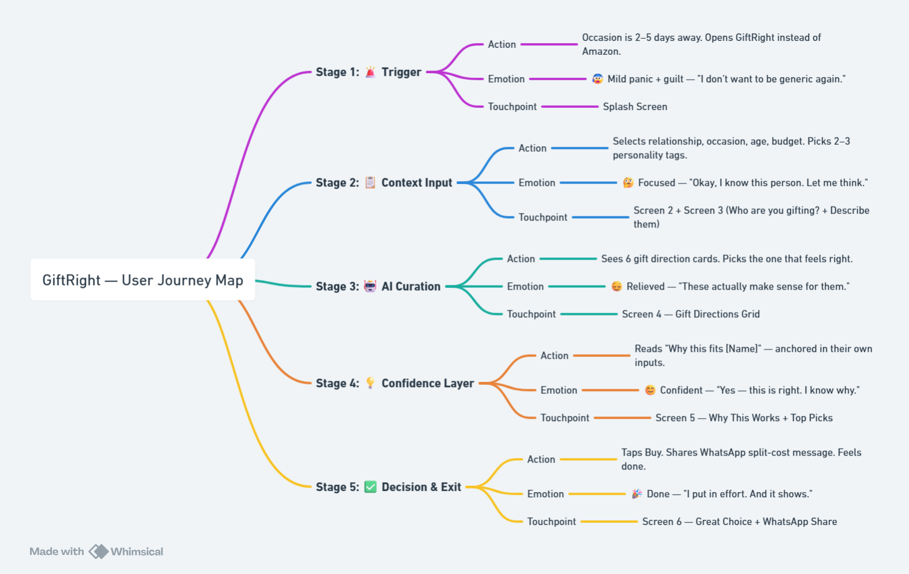
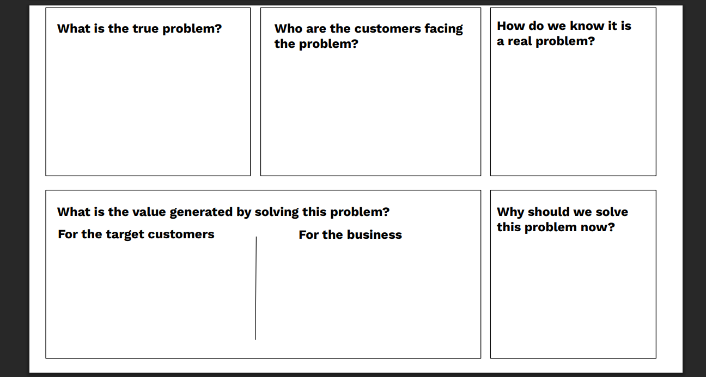
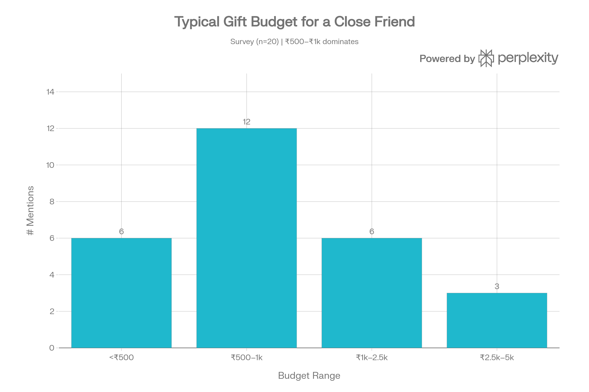
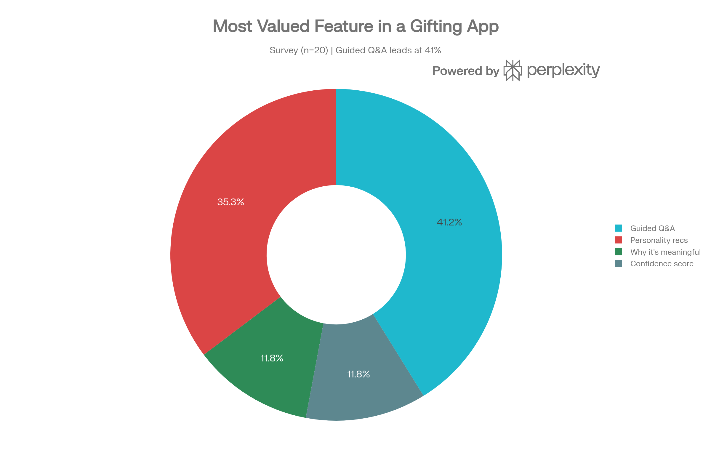

# 🎁 GiftRight — AI Gifting Confidence Tool

> **Context → Curation → Confidence**

GiftRight is an AI-powered gifting assistant that solves the real problem behind bad gifts — not finding options, but feeling *sure* the gift is right for this specific person.

Built as the **Graduation Project for NextLeap PM Fellowship — Cohort 44** (March 2026).

---

## 🚀 Live Prototype

---

## 🔍 The Problem

Gifting is not a product discovery problem. It's a **confidence problem.**

People don't struggle to find gifts — they struggle to feel sure the gift is right for *this specific person.*

| Stat | Finding |
|---|---|
| 3.5 / 5 | Average gifting stress score |
| 52% | Regretted a gift they gave |
| 42% | Top fear: "Will they like it?" |
| 90% | Spend 30+ minutes on a single gift decision |
| 87% | Want context-driven guidance, not just options |

> *"People don't run out of options. They run out of confidence."*

---

## 📦 What's in This Repo

| File | Description |
|---|---|
| [`NL GiftRight.pdf`](./NL%20GiftRight.pdf) | Final 10-slide deck |
| [`survey-data.xlsx.xlsx`](./survey-data.xlsx.xlsx) | Raw Jotform survey data (n=31) |
| [`Data flow diagram.png`](./Data%20flow%20diagram.png) | AI data flow diagram |
| [`end-to-end-journey.jpg.png`](./end-to-end-journey.jpg.png) | End-to-end customer journey map |
| [`comparison table.png`](./comparison%20table.png) | Competitor analysis table |
| [`problem-framing-canvas.png`](./problem-framing-canvas.png) | Problem framing canvas |
| [`Generated_chart__budget_bar.png.png`](./Generated_chart__budget_bar.png.png) | Survey chart — gift budget distribution |
| [`Generated_chart__feature_preference_donut.png.png`](./Generated_chart__feature_preference_donut.png.png) | Survey chart — feature preference breakdown |

---

## 🔗 Research & Supporting Links

| Asset | Link |
|---|---|
| 📋 Survey Data (Excel) | [Google Drive](https://docs.google.com/spreadsheets/d/1CHeRaL9bU73fr4lRI9rE2iZHP_LBq7AB/edit?usp=sharing) |
| 🎙️ Interview Audio Recordings | [Google Drive Folder](https://drive.google.com/drive/folders/14BuGMBFmPo3Xtc_issGCPE235q5ZHekS?usp=sharing) |
| 📝 Interview Notes + Synthesis | [Notion Page](https://www.notion.so/3314e0d023c68196b419f38f5aa48be7) |
| 🗺️ End-to-End Customer Journey | [Whimsical](https://whimsical.com/capco72/end-to-end-journey-of-the-customer-4ivurv1maBXzoGbpra3Vak) |
| 📊 Data Flow Diagram | [Whimsical](https://whimsical.com/capco72/data-flow-dig-graduatiopn-project-cohort-44-6idyat2ZLKiCLWwjZxGwom) |
| 🤖 AI Prompts Documentation | [Notion Page](https://www.notion.so/AI-Prompts-Documentation-GiftRight-32e4e0d023c6818fbacdf60b54cdadd2) |

---

## 🧠 Research Summary

### Survey — n=31 respondents (March 2026)

- 90% spend 30+ minutes on a single gift; 52% spend over 1 hour
- 39% want personality-based suggestions; 87% want context-driven guidance
- Only 7% of existing tools explain *why* a gift is meaningful

### Interviews — 5 users (March 2026)

5 in-depth interviews (18–25 yr olds, students & working professionals across India). Audio recordings available on Google Drive.

**Key finding across all 5 interviews:**
> Confidence in gifting = prior knowledge of the person. GiftRight's real job is to *reconstruct the feeling of knowing someone deeply* for occasions where that knowledge is incomplete.

### Hypotheses Validated

| Hypothesis | Verdict | Evidence |
|---|---|---|
| H1 — Storytelling / Narrative Gap | ✅ Strongly Confirmed | 4/5 best-ever gifts were non-material or had a strong personal story |
| H2 — Social Judgment Fear | ✅ Confirmed | *"The gift says something about my personality."* — Shreya Pandey |
| H3 — AI misses emotional layer | ✅ Confirmed | 2/2 ChatGPT users cited missing personal touch |
| H4 — Curation Fatigue | ✅ Confirmed | *"Tell me with reasons — not just more options."* — Prayas Gupta |
| H5 — Indian social visibility | ⚠️ Partially Confirmed | Instagram matters for 4/5; group UPI pooling weaker than assumed |

---

## 🖼️ Diagrams & Charts

### Data Flow

### End-to-End Customer Journey

### Competitor Analysis

### Problem Framing Canvas

### Survey — Gift Budget Distribution

### Survey — Feature Preference Breakdown

---

## 💡 How GiftRight Works

1. **Context Input** — User describes the recipient: relationship, personality, occasion, budget
2. **AI Curation** — LLM generates 6–8 gift directions tailored to the person
3. **Confidence Layer** — Top 3 gifts surfaced with *why this works* explanations using the user's own words
4. **Final Decision** — User picks with confidence; shareable via WhatsApp

---

## 💼 Business Model

| Phase | Revenue Model |
|---|---|
| V1 (Now) | Affiliate links — Flipkart / Amazon / Etsy |
| V2 | Confidence Pack — ₹99–199/month subscription |
| V3 | B2B corporate gifting API |

**North Star Metric:** % of users completing a gift decision in under 5 minutes.

---

## 🛠️ Tech Stack

- **Frontend & Prototype:** [Lovable.dev](https://lovable.dev)
- **AI / LLM:** Groq + LLaMA 3
- **Research & Planning:** Notion, Whimsical, Jotform

---

## 👤 Author

**Siddhant Jain** — AI Product Manager · NextLeap PM Fellowship Cohort 44

